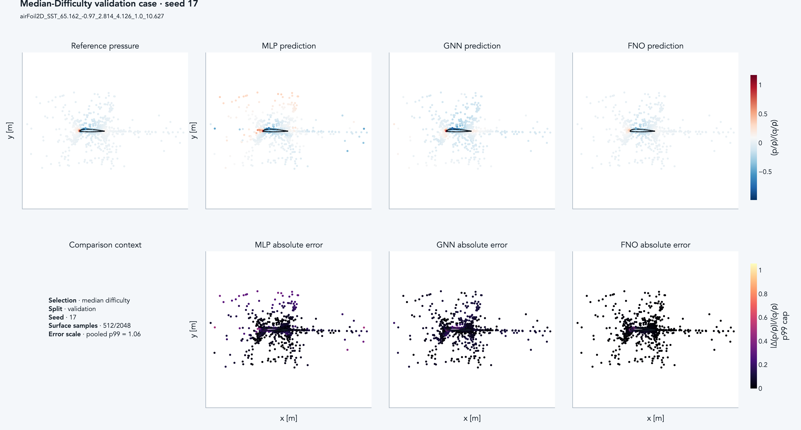
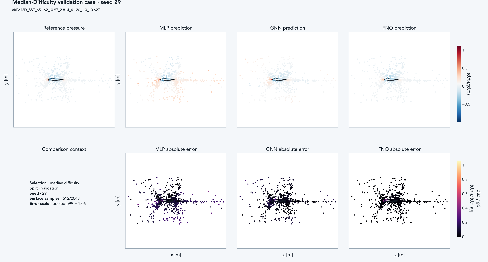
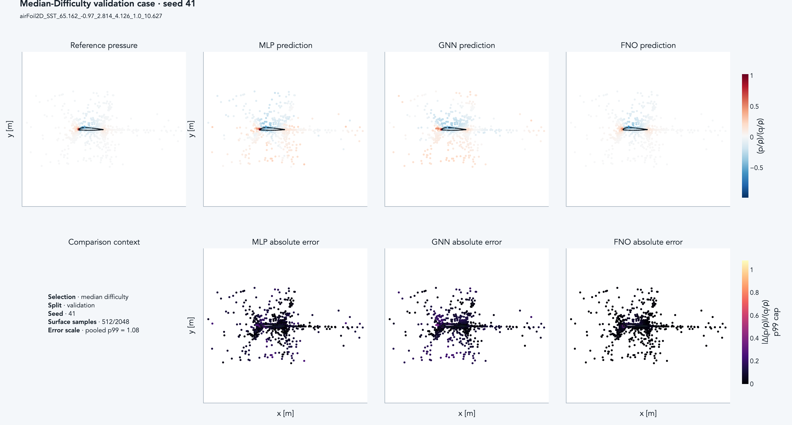
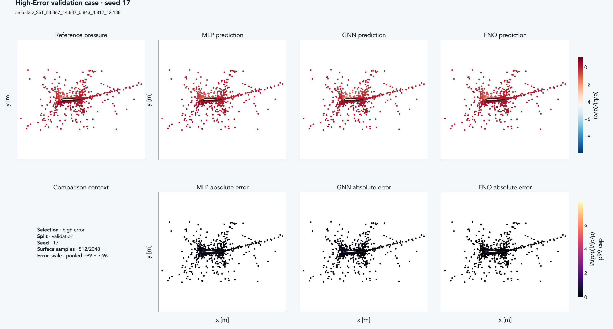
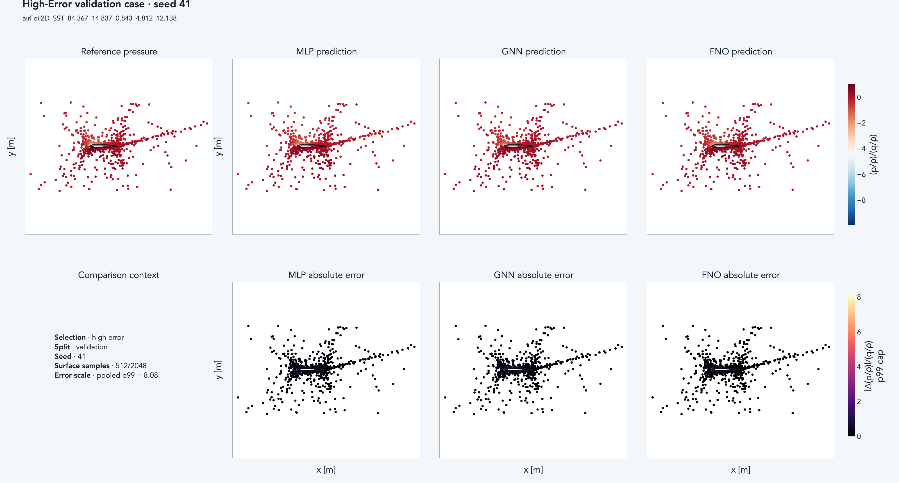
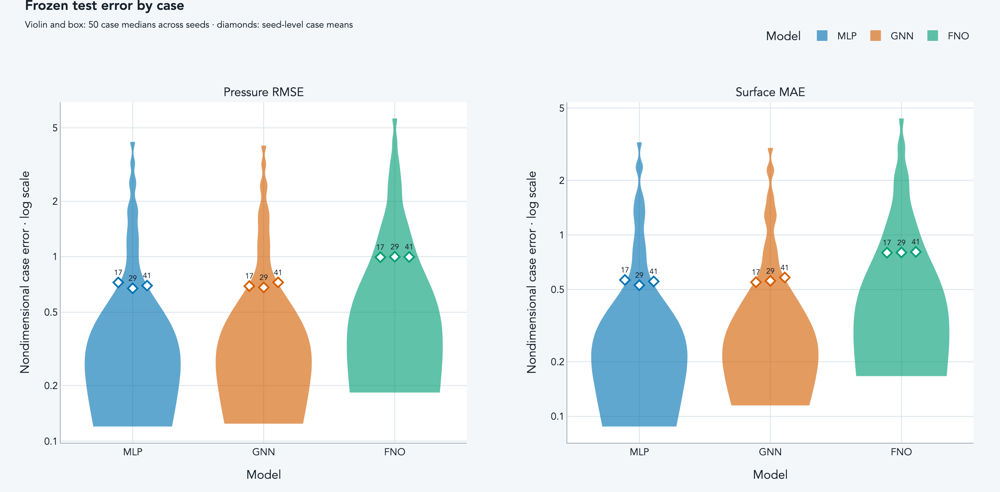
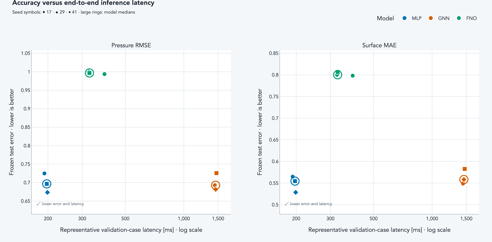

# AirfRANS model-comparison evidence

Status: COMPLETED MODEL-COMPARISON ANALYSIS; NO RETRAINING OR TUNING

## Evidence labels

**MEASURED** denotes values computed directly from completed run artifacts, validation inference using locked checkpoints, or profile samples saved by this analysis.

**INTERPRETATION** denotes explanations limited to what can be inferred from measured values.

**HYPOTHESIS** denotes candidate explanations that cannot be established without additional experiments.

The Sources column in every numeric table resolves to run IDs and artifact paths in the following source registry.

## Source registry

| Key | run_id | Artifact paths |
| --- | --- | --- |
| FNO17 | `airfrans-a1-final-fno-20260914T174114930305Z-845b847d6a00` | `reports/runs/airfrans-a1-final-fno-20260914T174114930305Z-845b847d6a00/per_case_metrics.json`; `reports/runs/airfrans-a1-final-fno-20260914T174114930305Z-845b847d6a00/metrics.json`; `reports/runs/airfrans-a1-final-fno-20260914T174114930305Z-845b847d6a00/timing.json`; `reports/runs/airfrans-a1-final-fno-20260914T174114930305Z-845b847d6a00/checkpoints/selected.pt` |
| FNO29 | `airfrans-a1-final-fno-20260914T175311967526Z-4fd6c0d33d6e` | `reports/runs/airfrans-a1-final-fno-20260914T175311967526Z-4fd6c0d33d6e/per_case_metrics.json`; `reports/runs/airfrans-a1-final-fno-20260914T175311967526Z-4fd6c0d33d6e/metrics.json`; `reports/runs/airfrans-a1-final-fno-20260914T175311967526Z-4fd6c0d33d6e/timing.json`; `reports/runs/airfrans-a1-final-fno-20260914T175311967526Z-4fd6c0d33d6e/checkpoints/selected.pt` |
| FNO41 | `airfrans-a1-final-fno-20260914T180832172659Z-24f9c3e857b9` | `reports/runs/airfrans-a1-final-fno-20260914T180832172659Z-24f9c3e857b9/per_case_metrics.json`; `reports/runs/airfrans-a1-final-fno-20260914T180832172659Z-24f9c3e857b9/metrics.json`; `reports/runs/airfrans-a1-final-fno-20260914T180832172659Z-24f9c3e857b9/timing.json`; `reports/runs/airfrans-a1-final-fno-20260914T180832172659Z-24f9c3e857b9/checkpoints/selected.pt` |
| GNN17 | `airfrans-a1-final-gnn-20260914T161630512662Z-e231245071ab` | `reports/runs/airfrans-a1-final-gnn-20260914T161630512662Z-e231245071ab/per_case_metrics.json`; `reports/runs/airfrans-a1-final-gnn-20260914T161630512662Z-e231245071ab/metrics.json`; `reports/runs/airfrans-a1-final-gnn-20260914T161630512662Z-e231245071ab/timing.json`; `reports/runs/airfrans-a1-final-gnn-20260914T161630512662Z-e231245071ab/checkpoints/selected.pt` |
| GNN29 | `airfrans-a1-final-gnn-20260914T163416373233Z-351ba431d17f` | `reports/runs/airfrans-a1-final-gnn-20260914T163416373233Z-351ba431d17f/per_case_metrics.json`; `reports/runs/airfrans-a1-final-gnn-20260914T163416373233Z-351ba431d17f/metrics.json`; `reports/runs/airfrans-a1-final-gnn-20260914T163416373233Z-351ba431d17f/timing.json`; `reports/runs/airfrans-a1-final-gnn-20260914T163416373233Z-351ba431d17f/checkpoints/selected.pt` |
| GNN41 | `airfrans-a1-final-gnn-20260914T165934681307Z-11912419dc89` | `reports/runs/airfrans-a1-final-gnn-20260914T165934681307Z-11912419dc89/per_case_metrics.json`; `reports/runs/airfrans-a1-final-gnn-20260914T165934681307Z-11912419dc89/metrics.json`; `reports/runs/airfrans-a1-final-gnn-20260914T165934681307Z-11912419dc89/timing.json`; `reports/runs/airfrans-a1-final-gnn-20260914T165934681307Z-11912419dc89/checkpoints/selected.pt` |
| MLP17 | `airfrans-a1-final-mlp-20260914T161006605574Z-98daaecc748c` | `reports/runs/airfrans-a1-final-mlp-20260914T161006605574Z-98daaecc748c/per_case_metrics.json`; `reports/runs/airfrans-a1-final-mlp-20260914T161006605574Z-98daaecc748c/metrics.json`; `reports/runs/airfrans-a1-final-mlp-20260914T161006605574Z-98daaecc748c/timing.json`; `reports/runs/airfrans-a1-final-mlp-20260914T161006605574Z-98daaecc748c/checkpoints/selected.pt` |
| MLP29 | `airfrans-a1-final-mlp-20260914T161210862935Z-ebe9c7630884` | `reports/runs/airfrans-a1-final-mlp-20260914T161210862935Z-ebe9c7630884/per_case_metrics.json`; `reports/runs/airfrans-a1-final-mlp-20260914T161210862935Z-ebe9c7630884/metrics.json`; `reports/runs/airfrans-a1-final-mlp-20260914T161210862935Z-ebe9c7630884/timing.json`; `reports/runs/airfrans-a1-final-mlp-20260914T161210862935Z-ebe9c7630884/checkpoints/selected.pt` |
| MLP41 | `airfrans-a1-final-mlp-20260914T161320001837Z-213c345f12e8` | `reports/runs/airfrans-a1-final-mlp-20260914T161320001837Z-213c345f12e8/per_case_metrics.json`; `reports/runs/airfrans-a1-final-mlp-20260914T161320001837Z-213c345f12e8/metrics.json`; `reports/runs/airfrans-a1-final-mlp-20260914T161320001837Z-213c345f12e8/timing.json`; `reports/runs/airfrans-a1-final-mlp-20260914T161320001837Z-213c345f12e8/checkpoints/selected.pt` |

The analysis artifact is `reports/summaries/model_comparison_evidence_data.json`, the profile artifact is `reports/summaries/model_comparison_profile.json`, and the field artifact is `reports/summaries/model_comparison_representative_predictions.npz`.

## Aggregate test metrics

MEASURED: Seeds in the frozen matrix are shown in individual rows. The case_median_across_seeds rows were aggregated after taking the median across seeds for each shared case.

P90 uses NumPy's linear quantile method, and lower error is better.

| Model | Scope | Metric | Count | Mean | Median | P90 | Sources |
| --- | --- | --- | ---: | ---: | ---: | ---: | --- |
| MLP | case_median_across_seeds | `pressure_rmse_nondimensional` | 50 | 0.698543 | 0.340173 | 1.768051 | MLP17=`airfrans-a1-final-mlp-20260914T161006605574Z-98daaecc748c`, MLP29=`airfrans-a1-final-mlp-20260914T161210862935Z-ebe9c7630884`, MLP41=`airfrans-a1-final-mlp-20260914T161320001837Z-213c345f12e8`; `reports/summaries/model_comparison_evidence_data.json` |
| MLP | seed_17 | `pressure_rmse_nondimensional` | 50 | 0.724848 | 0.327552 | 1.898195 | MLP17=`airfrans-a1-final-mlp-20260914T161006605574Z-98daaecc748c`; `reports/summaries/model_comparison_evidence_data.json` |
| MLP | seed_29 | `pressure_rmse_nondimensional` | 50 | 0.673539 | 0.341479 | 1.771397 | MLP29=`airfrans-a1-final-mlp-20260914T161210862935Z-ebe9c7630884`; `reports/summaries/model_comparison_evidence_data.json` |
| MLP | seed_41 | `pressure_rmse_nondimensional` | 50 | 0.696636 | 0.294000 | 1.771876 | MLP41=`airfrans-a1-final-mlp-20260914T161320001837Z-213c345f12e8`; `reports/summaries/model_comparison_evidence_data.json` |
| MLP | case_median_across_seeds | `surface_mae_nondimensional` | 50 | 0.551723 | 0.267467 | 1.399517 | MLP17=`airfrans-a1-final-mlp-20260914T161006605574Z-98daaecc748c`, MLP29=`airfrans-a1-final-mlp-20260914T161210862935Z-ebe9c7630884`, MLP41=`airfrans-a1-final-mlp-20260914T161320001837Z-213c345f12e8`; `reports/summaries/model_comparison_evidence_data.json` |
| MLP | seed_17 | `surface_mae_nondimensional` | 50 | 0.564820 | 0.289174 | 1.493936 | MLP17=`airfrans-a1-final-mlp-20260914T161006605574Z-98daaecc748c`; `reports/summaries/model_comparison_evidence_data.json` |
| MLP | seed_29 | `surface_mae_nondimensional` | 50 | 0.528466 | 0.252570 | 1.384190 | MLP29=`airfrans-a1-final-mlp-20260914T161210862935Z-ebe9c7630884`; `reports/summaries/model_comparison_evidence_data.json` |
| MLP | seed_41 | `surface_mae_nondimensional` | 50 | 0.554548 | 0.223403 | 1.408220 | MLP41=`airfrans-a1-final-mlp-20260914T161320001837Z-213c345f12e8`; `reports/summaries/model_comparison_evidence_data.json` |
| GNN | case_median_across_seeds | `pressure_rmse_nondimensional` | 50 | 0.691280 | 0.341875 | 1.754026 | GNN17=`airfrans-a1-final-gnn-20260914T161630512662Z-e231245071ab`, GNN29=`airfrans-a1-final-gnn-20260914T163416373233Z-351ba431d17f`, GNN41=`airfrans-a1-final-gnn-20260914T165934681307Z-11912419dc89`; `reports/summaries/model_comparison_evidence_data.json` |
| GNN | seed_17 | `pressure_rmse_nondimensional` | 50 | 0.692932 | 0.314101 | 1.816385 | GNN17=`airfrans-a1-final-gnn-20260914T161630512662Z-e231245071ab`; `reports/summaries/model_comparison_evidence_data.json` |
| GNN | seed_29 | `pressure_rmse_nondimensional` | 50 | 0.681600 | 0.357852 | 1.760281 | GNN29=`airfrans-a1-final-gnn-20260914T163416373233Z-351ba431d17f`; `reports/summaries/model_comparison_evidence_data.json` |
| GNN | seed_41 | `pressure_rmse_nondimensional` | 50 | 0.725730 | 0.374946 | 1.844533 | GNN41=`airfrans-a1-final-gnn-20260914T165934681307Z-11912419dc89`; `reports/summaries/model_comparison_evidence_data.json` |
| GNN | case_median_across_seeds | `surface_mae_nondimensional` | 50 | 0.553071 | 0.293004 | 1.320241 | GNN17=`airfrans-a1-final-gnn-20260914T161630512662Z-e231245071ab`, GNN29=`airfrans-a1-final-gnn-20260914T163416373233Z-351ba431d17f`, GNN41=`airfrans-a1-final-gnn-20260914T165934681307Z-11912419dc89`; `reports/summaries/model_comparison_evidence_data.json` |
| GNN | seed_17 | `surface_mae_nondimensional` | 50 | 0.548811 | 0.260591 | 1.405512 | GNN17=`airfrans-a1-final-gnn-20260914T161630512662Z-e231245071ab`; `reports/summaries/model_comparison_evidence_data.json` |
| GNN | seed_29 | `surface_mae_nondimensional` | 50 | 0.558251 | 0.315594 | 1.302826 | GNN29=`airfrans-a1-final-gnn-20260914T163416373233Z-351ba431d17f`; `reports/summaries/model_comparison_evidence_data.json` |
| GNN | seed_41 | `surface_mae_nondimensional` | 50 | 0.582720 | 0.323809 | 1.488835 | GNN41=`airfrans-a1-final-gnn-20260914T165934681307Z-11912419dc89`; `reports/summaries/model_comparison_evidence_data.json` |
| FNO | case_median_across_seeds | `pressure_rmse_nondimensional` | 50 | 0.996148 | 0.384698 | 2.465109 | FNO17=`airfrans-a1-final-fno-20260914T174114930305Z-845b847d6a00`, FNO29=`airfrans-a1-final-fno-20260914T175311967526Z-4fd6c0d33d6e`, FNO41=`airfrans-a1-final-fno-20260914T180832172659Z-24f9c3e857b9`; `reports/summaries/model_comparison_evidence_data.json` |
| FNO | seed_17 | `pressure_rmse_nondimensional` | 50 | 0.993675 | 0.358934 | 2.465109 | FNO17=`airfrans-a1-final-fno-20260914T174114930305Z-845b847d6a00`; `reports/summaries/model_comparison_evidence_data.json` |
| FNO | seed_29 | `pressure_rmse_nondimensional` | 50 | 0.999522 | 0.391500 | 2.496205 | FNO29=`airfrans-a1-final-fno-20260914T175311967526Z-4fd6c0d33d6e`; `reports/summaries/model_comparison_evidence_data.json` |
| FNO | seed_41 | `pressure_rmse_nondimensional` | 50 | 0.996703 | 0.384698 | 2.451900 | FNO41=`airfrans-a1-final-fno-20260914T180832172659Z-24f9c3e857b9`; `reports/summaries/model_comparison_evidence_data.json` |
| FNO | case_median_across_seeds | `surface_mae_nondimensional` | 50 | 0.800271 | 0.336947 | 1.972393 | FNO17=`airfrans-a1-final-fno-20260914T174114930305Z-845b847d6a00`, FNO29=`airfrans-a1-final-fno-20260914T175311967526Z-4fd6c0d33d6e`, FNO41=`airfrans-a1-final-fno-20260914T180832172659Z-24f9c3e857b9`; `reports/summaries/model_comparison_evidence_data.json` |
| FNO | seed_17 | `surface_mae_nondimensional` | 50 | 0.798104 | 0.324378 | 1.967289 | FNO17=`airfrans-a1-final-fno-20260914T174114930305Z-845b847d6a00`; `reports/summaries/model_comparison_evidence_data.json` |
| FNO | seed_29 | `surface_mae_nondimensional` | 50 | 0.800254 | 0.336947 | 1.988291 | FNO29=`airfrans-a1-final-fno-20260914T175311967526Z-4fd6c0d33d6e`; `reports/summaries/model_comparison_evidence_data.json` |
| FNO | seed_41 | `surface_mae_nondimensional` | 50 | 0.806756 | 0.338248 | 1.972393 | FNO41=`airfrans-a1-final-fno-20260914T180832172659Z-24f9c3e857b9`; `reports/summaries/model_comparison_evidence_data.json` |

## Paired per-case comparisons

MEASURED: Differences are the first model minus the second model.

A negative difference means that the first model has lower error. Lower counts are ordered as first / second / ties.

The case_median_across_seeds rows were paired by shared case ID after taking the median across seeds for each case.

| Pair | Scope | Metric | Count | Mean difference | Median difference | P90 difference | Lower counts | Sources |
| --- | --- | --- | ---: | ---: | ---: | ---: | --- | --- |
| MLP - GNN | seed_17 | `pressure_rmse_nondimensional` | 50 | 0.031916 | -0.006597 | 0.129583 | 26 / 24 / 0 | MLP17=`airfrans-a1-final-mlp-20260914T161006605574Z-98daaecc748c`, GNN17=`airfrans-a1-final-gnn-20260914T161630512662Z-e231245071ab`; `reports/summaries/model_comparison_evidence_data.json` |
| MLP - GNN | seed_29 | `pressure_rmse_nondimensional` | 50 | -0.008061 | 0.009127 | 0.148064 | 23 / 27 / 0 | MLP29=`airfrans-a1-final-mlp-20260914T161210862935Z-ebe9c7630884`, GNN29=`airfrans-a1-final-gnn-20260914T163416373233Z-351ba431d17f`; `reports/summaries/model_comparison_evidence_data.json` |
| MLP - GNN | seed_41 | `pressure_rmse_nondimensional` | 50 | -0.029093 | -0.024684 | 0.075914 | 29 / 21 / 0 | MLP41=`airfrans-a1-final-mlp-20260914T161320001837Z-213c345f12e8`, GNN41=`airfrans-a1-final-gnn-20260914T165934681307Z-11912419dc89`; `reports/summaries/model_comparison_evidence_data.json` |
| MLP - GNN | case_median_across_seeds | `pressure_rmse_nondimensional` | 50 | 0.007263 | 0.005429 | 0.063179 | 23 / 27 / 0 | MLP17=`airfrans-a1-final-mlp-20260914T161006605574Z-98daaecc748c`, MLP29=`airfrans-a1-final-mlp-20260914T161210862935Z-ebe9c7630884`, MLP41=`airfrans-a1-final-mlp-20260914T161320001837Z-213c345f12e8`, GNN17=`airfrans-a1-final-gnn-20260914T161630512662Z-e231245071ab`, GNN29=`airfrans-a1-final-gnn-20260914T163416373233Z-351ba431d17f`, GNN41=`airfrans-a1-final-gnn-20260914T165934681307Z-11912419dc89`; `reports/summaries/model_comparison_evidence_data.json` |
| MLP - GNN | seed_17 | `surface_mae_nondimensional` | 50 | 0.016009 | -0.002065 | 0.118659 | 26 / 24 / 0 | MLP17=`airfrans-a1-final-mlp-20260914T161006605574Z-98daaecc748c`, GNN17=`airfrans-a1-final-gnn-20260914T161630512662Z-e231245071ab`; `reports/summaries/model_comparison_evidence_data.json` |
| MLP - GNN | seed_29 | `surface_mae_nondimensional` | 50 | -0.029785 | -0.011609 | 0.174302 | 29 / 21 / 0 | MLP29=`airfrans-a1-final-mlp-20260914T161210862935Z-ebe9c7630884`, GNN29=`airfrans-a1-final-gnn-20260914T163416373233Z-351ba431d17f`; `reports/summaries/model_comparison_evidence_data.json` |
| MLP - GNN | seed_41 | `surface_mae_nondimensional` | 50 | -0.028171 | -0.022603 | 0.064047 | 29 / 21 / 0 | MLP41=`airfrans-a1-final-mlp-20260914T161320001837Z-213c345f12e8`, GNN41=`airfrans-a1-final-gnn-20260914T165934681307Z-11912419dc89`; `reports/summaries/model_comparison_evidence_data.json` |
| MLP - GNN | case_median_across_seeds | `surface_mae_nondimensional` | 50 | -0.001349 | -0.012391 | 0.087040 | 28 / 22 / 0 | MLP17=`airfrans-a1-final-mlp-20260914T161006605574Z-98daaecc748c`, MLP29=`airfrans-a1-final-mlp-20260914T161210862935Z-ebe9c7630884`, MLP41=`airfrans-a1-final-mlp-20260914T161320001837Z-213c345f12e8`, GNN17=`airfrans-a1-final-gnn-20260914T161630512662Z-e231245071ab`, GNN29=`airfrans-a1-final-gnn-20260914T163416373233Z-351ba431d17f`, GNN41=`airfrans-a1-final-gnn-20260914T165934681307Z-11912419dc89`; `reports/summaries/model_comparison_evidence_data.json` |
| MLP - FNO | seed_17 | `pressure_rmse_nondimensional` | 50 | -0.268827 | -0.109408 | 0.063801 | 43 / 7 / 0 | MLP17=`airfrans-a1-final-mlp-20260914T161006605574Z-98daaecc748c`, FNO17=`airfrans-a1-final-fno-20260914T174114930305Z-845b847d6a00`; `reports/summaries/model_comparison_evidence_data.json` |
| MLP - FNO | seed_29 | `pressure_rmse_nondimensional` | 50 | -0.325984 | -0.097149 | 0.056612 | 43 / 7 / 0 | MLP29=`airfrans-a1-final-mlp-20260914T161210862935Z-ebe9c7630884`, FNO29=`airfrans-a1-final-fno-20260914T175311967526Z-4fd6c0d33d6e`; `reports/summaries/model_comparison_evidence_data.json` |
| MLP - FNO | seed_41 | `pressure_rmse_nondimensional` | 50 | -0.300066 | -0.097603 | 0.032175 | 43 / 7 / 0 | MLP41=`airfrans-a1-final-mlp-20260914T161320001837Z-213c345f12e8`, FNO41=`airfrans-a1-final-fno-20260914T180832172659Z-24f9c3e857b9`; `reports/summaries/model_comparison_evidence_data.json` |
| MLP - FNO | case_median_across_seeds | `pressure_rmse_nondimensional` | 50 | -0.297604 | -0.086996 | 0.030309 | 43 / 7 / 0 | MLP17=`airfrans-a1-final-mlp-20260914T161006605574Z-98daaecc748c`, MLP29=`airfrans-a1-final-mlp-20260914T161210862935Z-ebe9c7630884`, MLP41=`airfrans-a1-final-mlp-20260914T161320001837Z-213c345f12e8`, FNO17=`airfrans-a1-final-fno-20260914T174114930305Z-845b847d6a00`, FNO29=`airfrans-a1-final-fno-20260914T175311967526Z-4fd6c0d33d6e`, FNO41=`airfrans-a1-final-fno-20260914T180832172659Z-24f9c3e857b9`; `reports/summaries/model_comparison_evidence_data.json` |
| MLP - FNO | seed_17 | `surface_mae_nondimensional` | 50 | -0.233284 | -0.098483 | 0.067858 | 40 / 10 / 0 | MLP17=`airfrans-a1-final-mlp-20260914T161006605574Z-98daaecc748c`, FNO17=`airfrans-a1-final-fno-20260914T174114930305Z-845b847d6a00`; `reports/summaries/model_comparison_evidence_data.json` |
| MLP - FNO | seed_29 | `surface_mae_nondimensional` | 50 | -0.271788 | -0.102004 | 0.061543 | 42 / 8 / 0 | MLP29=`airfrans-a1-final-mlp-20260914T161210862935Z-ebe9c7630884`, FNO29=`airfrans-a1-final-fno-20260914T175311967526Z-4fd6c0d33d6e`; `reports/summaries/model_comparison_evidence_data.json` |
| MLP - FNO | seed_41 | `surface_mae_nondimensional` | 50 | -0.252207 | -0.112998 | 0.038642 | 42 / 8 / 0 | MLP41=`airfrans-a1-final-mlp-20260914T161320001837Z-213c345f12e8`, FNO41=`airfrans-a1-final-fno-20260914T180832172659Z-24f9c3e857b9`; `reports/summaries/model_comparison_evidence_data.json` |
| MLP - FNO | case_median_across_seeds | `surface_mae_nondimensional` | 50 | -0.248548 | -0.098293 | 0.031444 | 44 / 6 / 0 | MLP17=`airfrans-a1-final-mlp-20260914T161006605574Z-98daaecc748c`, MLP29=`airfrans-a1-final-mlp-20260914T161210862935Z-ebe9c7630884`, MLP41=`airfrans-a1-final-mlp-20260914T161320001837Z-213c345f12e8`, FNO17=`airfrans-a1-final-fno-20260914T174114930305Z-845b847d6a00`, FNO29=`airfrans-a1-final-fno-20260914T175311967526Z-4fd6c0d33d6e`, FNO41=`airfrans-a1-final-fno-20260914T180832172659Z-24f9c3e857b9`; `reports/summaries/model_comparison_evidence_data.json` |
| GNN - FNO | seed_17 | `pressure_rmse_nondimensional` | 50 | -0.300743 | -0.090839 | -0.023422 | 46 / 4 / 0 | GNN17=`airfrans-a1-final-gnn-20260914T161630512662Z-e231245071ab`, FNO17=`airfrans-a1-final-fno-20260914T174114930305Z-845b847d6a00`; `reports/summaries/model_comparison_evidence_data.json` |
| GNN - FNO | seed_29 | `pressure_rmse_nondimensional` | 50 | -0.317922 | -0.089520 | 0.146754 | 39 / 11 / 0 | GNN29=`airfrans-a1-final-gnn-20260914T163416373233Z-351ba431d17f`, FNO29=`airfrans-a1-final-fno-20260914T175311967526Z-4fd6c0d33d6e`; `reports/summaries/model_comparison_evidence_data.json` |
| GNN - FNO | seed_41 | `pressure_rmse_nondimensional` | 50 | -0.270973 | -0.088121 | 0.030554 | 39 / 11 / 0 | GNN41=`airfrans-a1-final-gnn-20260914T165934681307Z-11912419dc89`, FNO41=`airfrans-a1-final-fno-20260914T180832172659Z-24f9c3e857b9`; `reports/summaries/model_comparison_evidence_data.json` |
| GNN - FNO | case_median_across_seeds | `pressure_rmse_nondimensional` | 50 | -0.304868 | -0.089984 | 0.029481 | 42 / 8 / 0 | GNN17=`airfrans-a1-final-gnn-20260914T161630512662Z-e231245071ab`, GNN29=`airfrans-a1-final-gnn-20260914T163416373233Z-351ba431d17f`, GNN41=`airfrans-a1-final-gnn-20260914T165934681307Z-11912419dc89`, FNO17=`airfrans-a1-final-fno-20260914T174114930305Z-845b847d6a00`, FNO29=`airfrans-a1-final-fno-20260914T175311967526Z-4fd6c0d33d6e`, FNO41=`airfrans-a1-final-fno-20260914T180832172659Z-24f9c3e857b9`; `reports/summaries/model_comparison_evidence_data.json` |
| GNN - FNO | seed_17 | `surface_mae_nondimensional` | 50 | -0.249292 | -0.097039 | -0.009640 | 45 / 5 / 0 | GNN17=`airfrans-a1-final-gnn-20260914T161630512662Z-e231245071ab`, FNO17=`airfrans-a1-final-fno-20260914T174114930305Z-845b847d6a00`; `reports/summaries/model_comparison_evidence_data.json` |
| GNN - FNO | seed_29 | `surface_mae_nondimensional` | 50 | -0.242003 | -0.085066 | 0.151544 | 39 / 11 / 0 | GNN29=`airfrans-a1-final-gnn-20260914T163416373233Z-351ba431d17f`, FNO29=`airfrans-a1-final-fno-20260914T175311967526Z-4fd6c0d33d6e`; `reports/summaries/model_comparison_evidence_data.json` |
| GNN - FNO | seed_41 | `surface_mae_nondimensional` | 50 | -0.224036 | -0.085486 | 0.102507 | 37 / 13 / 0 | GNN41=`airfrans-a1-final-gnn-20260914T165934681307Z-11912419dc89`, FNO41=`airfrans-a1-final-fno-20260914T180832172659Z-24f9c3e857b9`; `reports/summaries/model_comparison_evidence_data.json` |
| GNN - FNO | case_median_across_seeds | `surface_mae_nondimensional` | 50 | -0.247200 | -0.085347 | 0.044907 | 41 / 9 / 0 | GNN17=`airfrans-a1-final-gnn-20260914T161630512662Z-e231245071ab`, GNN29=`airfrans-a1-final-gnn-20260914T163416373233Z-351ba431d17f`, GNN41=`airfrans-a1-final-gnn-20260914T165934681307Z-11912419dc89`, FNO17=`airfrans-a1-final-fno-20260914T174114930305Z-845b847d6a00`, FNO29=`airfrans-a1-final-fno-20260914T175311967526Z-4fd6c0d33d6e`, FNO41=`airfrans-a1-final-fno-20260914T180832172659Z-24f9c3e857b9`; `reports/summaries/model_comparison_evidence_data.json` |

## Representative validation cases

MEASURED: The difficulty score for each validation case is the median pressure RMSE across all locked model-seed runs.

The median_difficulty case has the difficulty score closest to the median across all validation cases. The high_error case has the largest difficulty score. Ties are resolved by lexicographic case ID order.

This rule does not rerun inference on test cases and uses the same case for every model and seed.

| Role | Case ID | Difficulty score | Population median | Sources |
| --- | --- | ---: | ---: | --- |
| high_error | `airFoil2D_SST_84.367_14.837_0.843_4.812_12.138` | 2.408260 | 0.262803 | FNO17=`airfrans-a1-final-fno-20260914T174114930305Z-845b847d6a00`, FNO29=`airfrans-a1-final-fno-20260914T175311967526Z-4fd6c0d33d6e`, FNO41=`airfrans-a1-final-fno-20260914T180832172659Z-24f9c3e857b9`, GNN17=`airfrans-a1-final-gnn-20260914T161630512662Z-e231245071ab`, GNN29=`airfrans-a1-final-gnn-20260914T163416373233Z-351ba431d17f`, GNN41=`airfrans-a1-final-gnn-20260914T165934681307Z-11912419dc89`, MLP17=`airfrans-a1-final-mlp-20260914T161006605574Z-98daaecc748c`, MLP29=`airfrans-a1-final-mlp-20260914T161210862935Z-ebe9c7630884`, MLP41=`airfrans-a1-final-mlp-20260914T161320001837Z-213c345f12e8`; `reports/summaries/model_comparison_evidence_data.json` |
| median_difficulty | `airFoil2D_SST_65.162_-0.97_2.814_4.126_1.0_10.627` | 0.261068 | 0.262803 | FNO17=`airfrans-a1-final-fno-20260914T174114930305Z-845b847d6a00`, FNO29=`airfrans-a1-final-fno-20260914T175311967526Z-4fd6c0d33d6e`, FNO41=`airfrans-a1-final-fno-20260914T180832172659Z-24f9c3e857b9`, GNN17=`airfrans-a1-final-gnn-20260914T161630512662Z-e231245071ab`, GNN29=`airfrans-a1-final-gnn-20260914T163416373233Z-351ba431d17f`, GNN41=`airfrans-a1-final-gnn-20260914T165934681307Z-11912419dc89`, MLP17=`airfrans-a1-final-mlp-20260914T161006605574Z-98daaecc748c`, MLP29=`airfrans-a1-final-mlp-20260914T161210862935Z-ebe9c7630884`, MLP41=`airfrans-a1-final-mlp-20260914T161320001837Z-213c345f12e8`; `reports/summaries/model_comparison_evidence_data.json` |

## Pressure fields

MEASURED: Every pressure panel within a figure shares one color scale. Absolute-error panels share a color scale capped at the pooled pointwise p99 for visibility; larger displayed values use the top color, while all reported metrics remain uncapped.

### median_difficulty, seed 17

MEASURED: Reference pressure, prediction, and absolute error are shown for the same validation case. Sources: MLP17=`airfrans-a1-final-mlp-20260914T161006605574Z-98daaecc748c`, GNN17=`airfrans-a1-final-gnn-20260914T161630512662Z-e231245071ab`, FNO17=`airfrans-a1-final-fno-20260914T174114930305Z-845b847d6a00`; `reports/summaries/model_comparison_representative_predictions.npz`; `reports/figures/model_comparison/median_difficulty_seed_17.png`.

### median_difficulty, seed 29

MEASURED: Reference pressure, prediction, and absolute error are shown for the same validation case. Sources: MLP29=`airfrans-a1-final-mlp-20260914T161210862935Z-ebe9c7630884`, GNN29=`airfrans-a1-final-gnn-20260914T163416373233Z-351ba431d17f`, FNO29=`airfrans-a1-final-fno-20260914T175311967526Z-4fd6c0d33d6e`; `reports/summaries/model_comparison_representative_predictions.npz`; `reports/figures/model_comparison/median_difficulty_seed_29.png`.

### median_difficulty, seed 41

MEASURED: Reference pressure, prediction, and absolute error are shown for the same validation case. Sources: MLP41=`airfrans-a1-final-mlp-20260914T161320001837Z-213c345f12e8`, GNN41=`airfrans-a1-final-gnn-20260914T165934681307Z-11912419dc89`, FNO41=`airfrans-a1-final-fno-20260914T180832172659Z-24f9c3e857b9`; `reports/summaries/model_comparison_representative_predictions.npz`; `reports/figures/model_comparison/median_difficulty_seed_41.png`.

### high_error, seed 17

MEASURED: Reference pressure, prediction, and absolute error are shown for the same validation case. Sources: MLP17=`airfrans-a1-final-mlp-20260914T161006605574Z-98daaecc748c`, GNN17=`airfrans-a1-final-gnn-20260914T161630512662Z-e231245071ab`, FNO17=`airfrans-a1-final-fno-20260914T174114930305Z-845b847d6a00`; `reports/summaries/model_comparison_representative_predictions.npz`; `reports/figures/model_comparison/high_error_seed_17.png`.

### high_error, seed 29

MEASURED: Reference pressure, prediction, and absolute error are shown for the same validation case. Sources: MLP29=`airfrans-a1-final-mlp-20260914T161210862935Z-ebe9c7630884`, GNN29=`airfrans-a1-final-gnn-20260914T163416373233Z-351ba431d17f`, FNO29=`airfrans-a1-final-fno-20260914T175311967526Z-4fd6c0d33d6e`; `reports/summaries/model_comparison_representative_predictions.npz`; `reports/figures/model_comparison/high_error_seed_29.png`.

### high_error, seed 41

MEASURED: Reference pressure, prediction, and absolute error are shown for the same validation case. Sources: MLP41=`airfrans-a1-final-mlp-20260914T161320001837Z-213c345f12e8`, GNN41=`airfrans-a1-final-gnn-20260914T165934681307Z-11912419dc89`, FNO41=`airfrans-a1-final-fno-20260914T180832172659Z-24f9c3e857b9`; `reports/summaries/model_comparison_representative_predictions.npz`; `reports/figures/model_comparison/high_error_seed_41.png`.

## Per-case error distributions

MEASURED: Violin shapes and internal boxes show the distribution of 50 shared test-case errors after taking the median across seeds for each case. Seed-labeled diamonds show the case-macro mean for each seed. The vertical axis is logarithmic. Sources: FNO17=`airfrans-a1-final-fno-20260914T174114930305Z-845b847d6a00`, FNO29=`airfrans-a1-final-fno-20260914T175311967526Z-4fd6c0d33d6e`, FNO41=`airfrans-a1-final-fno-20260914T180832172659Z-24f9c3e857b9`, GNN17=`airfrans-a1-final-gnn-20260914T161630512662Z-e231245071ab`, GNN29=`airfrans-a1-final-gnn-20260914T163416373233Z-351ba431d17f`, GNN41=`airfrans-a1-final-gnn-20260914T165934681307Z-11912419dc89`, MLP17=`airfrans-a1-final-mlp-20260914T161006605574Z-98daaecc748c`, MLP29=`airfrans-a1-final-mlp-20260914T161210862935Z-ebe9c7630884`, MLP41=`airfrans-a1-final-mlp-20260914T161320001837Z-213c345f12e8`; `reports/summaries/model_comparison_evidence_data.json`; `reports/figures/model_comparison/per_case_error_distributions.png`.

## Inference profile

MEASURED: Profiling used only the representative validation cases.

Preprocessing includes VTU loading, feature and grid or graph construction, and application of the checkpoint normalizer.

model_forward includes only the forward call. postprocessing_query includes the FNO grid-to-point query or point output, denormalization, and case-metric calculation.

end_to_end directly measures preprocessing, forward, and postprocessing/query together; it excludes checkpoint loading and model initialization.

Each component was measured after an unmeasured warmup, so the filesystem cache was warm.

| Model | Seed | Component | Samples | Mean ms | Median ms | P90 ms | Sources |
| --- | ---: | --- | ---: | ---: | ---: | ---: | --- |
| FNO | 17 | preprocessing | 6 | 390.385389 | 371.505396 | 465.820063 | FNO17=`airfrans-a1-final-fno-20260914T174114930305Z-845b847d6a00`; `reports/summaries/model_comparison_profile.json`; `reports/runs/airfrans-a1-final-fno-20260914T174114930305Z-845b847d6a00/checkpoints/selected.pt` |
| FNO | 17 | model_forward | 60 | 8.429381 | 8.372229 | 10.394629 | FNO17=`airfrans-a1-final-fno-20260914T174114930305Z-845b847d6a00`; `reports/summaries/model_comparison_profile.json`; `reports/runs/airfrans-a1-final-fno-20260914T174114930305Z-845b847d6a00/checkpoints/selected.pt` |
| FNO | 17 | postprocessing_query | 60 | 0.275768 | 0.229209 | 0.343950 | FNO17=`airfrans-a1-final-fno-20260914T174114930305Z-845b847d6a00`; `reports/summaries/model_comparison_profile.json`; `reports/runs/airfrans-a1-final-fno-20260914T174114930305Z-845b847d6a00/checkpoints/selected.pt` |
| FNO | 17 | end_to_end | 6 | 400.850757 | 367.327417 | 511.641396 | FNO17=`airfrans-a1-final-fno-20260914T174114930305Z-845b847d6a00`; `reports/summaries/model_comparison_profile.json`; `reports/runs/airfrans-a1-final-fno-20260914T174114930305Z-845b847d6a00/checkpoints/selected.pt` |
| FNO | 29 | preprocessing | 6 | 329.656972 | 320.550709 | 358.156500 | FNO29=`airfrans-a1-final-fno-20260914T175311967526Z-4fd6c0d33d6e`; `reports/summaries/model_comparison_profile.json`; `reports/runs/airfrans-a1-final-fno-20260914T175311967526Z-4fd6c0d33d6e/checkpoints/selected.pt` |
| FNO | 29 | model_forward | 60 | 8.994029 | 8.590604 | 11.431754 | FNO29=`airfrans-a1-final-fno-20260914T175311967526Z-4fd6c0d33d6e`; `reports/summaries/model_comparison_profile.json`; `reports/runs/airfrans-a1-final-fno-20260914T175311967526Z-4fd6c0d33d6e/checkpoints/selected.pt` |
| FNO | 29 | postprocessing_query | 60 | 0.288762 | 0.309500 | 0.527271 | FNO29=`airfrans-a1-final-fno-20260914T175311967526Z-4fd6c0d33d6e`; `reports/summaries/model_comparison_profile.json`; `reports/runs/airfrans-a1-final-fno-20260914T175311967526Z-4fd6c0d33d6e/checkpoints/selected.pt` |
| FNO | 29 | end_to_end | 6 | 340.327938 | 328.690000 | 381.250667 | FNO29=`airfrans-a1-final-fno-20260914T175311967526Z-4fd6c0d33d6e`; `reports/summaries/model_comparison_profile.json`; `reports/runs/airfrans-a1-final-fno-20260914T175311967526Z-4fd6c0d33d6e/checkpoints/selected.pt` |
| FNO | 41 | preprocessing | 6 | 318.145730 | 318.292583 | 334.633438 | FNO41=`airfrans-a1-final-fno-20260914T180832172659Z-24f9c3e857b9`; `reports/summaries/model_comparison_profile.json`; `reports/runs/airfrans-a1-final-fno-20260914T180832172659Z-24f9c3e857b9/checkpoints/selected.pt` |
| FNO | 41 | model_forward | 60 | 8.165967 | 7.952063 | 10.018938 | FNO41=`airfrans-a1-final-fno-20260914T180832172659Z-24f9c3e857b9`; `reports/summaries/model_comparison_profile.json`; `reports/runs/airfrans-a1-final-fno-20260914T180832172659Z-24f9c3e857b9/checkpoints/selected.pt` |
| FNO | 41 | postprocessing_query | 60 | 0.255592 | 0.302813 | 0.356363 | FNO41=`airfrans-a1-final-fno-20260914T180832172659Z-24f9c3e857b9`; `reports/summaries/model_comparison_profile.json`; `reports/runs/airfrans-a1-final-fno-20260914T180832172659Z-24f9c3e857b9/checkpoints/selected.pt` |
| FNO | 41 | end_to_end | 6 | 325.768931 | 324.899000 | 341.112791 | FNO41=`airfrans-a1-final-fno-20260914T180832172659Z-24f9c3e857b9`; `reports/summaries/model_comparison_profile.json`; `reports/runs/airfrans-a1-final-fno-20260914T180832172659Z-24f9c3e857b9/checkpoints/selected.pt` |
| GNN | 17 | preprocessing | 6 | 1516.242021 | 1472.560750 | 1696.872604 | GNN17=`airfrans-a1-final-gnn-20260914T161630512662Z-e231245071ab`; `reports/summaries/model_comparison_profile.json`; `reports/runs/airfrans-a1-final-gnn-20260914T161630512662Z-e231245071ab/checkpoints/selected.pt` |
| GNN | 17 | model_forward | 60 | 20.452322 | 17.866667 | 27.806083 | GNN17=`airfrans-a1-final-gnn-20260914T161630512662Z-e231245071ab`; `reports/summaries/model_comparison_profile.json`; `reports/runs/airfrans-a1-final-gnn-20260914T161630512662Z-e231245071ab/checkpoints/selected.pt` |
| GNN | 17 | postprocessing_query | 60 | 0.072390 | 0.048792 | 0.109396 | GNN17=`airfrans-a1-final-gnn-20260914T161630512662Z-e231245071ab`; `reports/summaries/model_comparison_profile.json`; `reports/runs/airfrans-a1-final-gnn-20260914T161630512662Z-e231245071ab/checkpoints/selected.pt` |
| GNN | 17 | end_to_end | 6 | 1504.269868 | 1436.311437 | 1751.703792 | GNN17=`airfrans-a1-final-gnn-20260914T161630512662Z-e231245071ab`; `reports/summaries/model_comparison_profile.json`; `reports/runs/airfrans-a1-final-gnn-20260914T161630512662Z-e231245071ab/checkpoints/selected.pt` |
| GNN | 29 | preprocessing | 6 | 1481.015146 | 1485.608666 | 1529.083354 | GNN29=`airfrans-a1-final-gnn-20260914T163416373233Z-351ba431d17f`; `reports/summaries/model_comparison_profile.json`; `reports/runs/airfrans-a1-final-gnn-20260914T163416373233Z-351ba431d17f/checkpoints/selected.pt` |
| GNN | 29 | model_forward | 60 | 18.243209 | 16.996313 | 20.774650 | GNN29=`airfrans-a1-final-gnn-20260914T163416373233Z-351ba431d17f`; `reports/summaries/model_comparison_profile.json`; `reports/runs/airfrans-a1-final-gnn-20260914T163416373233Z-351ba431d17f/checkpoints/selected.pt` |
| GNN | 29 | postprocessing_query | 60 | 0.045244 | 0.046354 | 0.047471 | GNN29=`airfrans-a1-final-gnn-20260914T163416373233Z-351ba431d17f`; `reports/summaries/model_comparison_profile.json`; `reports/runs/airfrans-a1-final-gnn-20260914T163416373233Z-351ba431d17f/checkpoints/selected.pt` |
| GNN | 29 | end_to_end | 6 | 1483.037833 | 1488.243417 | 1566.273896 | GNN29=`airfrans-a1-final-gnn-20260914T163416373233Z-351ba431d17f`; `reports/summaries/model_comparison_profile.json`; `reports/runs/airfrans-a1-final-gnn-20260914T163416373233Z-351ba431d17f/checkpoints/selected.pt` |
| GNN | 41 | preprocessing | 6 | 1499.575827 | 1498.491354 | 1559.117042 | GNN41=`airfrans-a1-final-gnn-20260914T165934681307Z-11912419dc89`; `reports/summaries/model_comparison_profile.json`; `reports/runs/airfrans-a1-final-gnn-20260914T165934681307Z-11912419dc89/checkpoints/selected.pt` |
| GNN | 41 | model_forward | 60 | 19.459110 | 17.658000 | 25.432896 | GNN41=`airfrans-a1-final-gnn-20260914T165934681307Z-11912419dc89`; `reports/summaries/model_comparison_profile.json`; `reports/runs/airfrans-a1-final-gnn-20260914T165934681307Z-11912419dc89/checkpoints/selected.pt` |
| GNN | 41 | postprocessing_query | 60 | 0.057799 | 0.048938 | 0.070526 | GNN41=`airfrans-a1-final-gnn-20260914T165934681307Z-11912419dc89`; `reports/summaries/model_comparison_profile.json`; `reports/runs/airfrans-a1-final-gnn-20260914T165934681307Z-11912419dc89/checkpoints/selected.pt` |
| GNN | 41 | end_to_end | 6 | 1483.443069 | 1494.517020 | 1539.866041 | GNN41=`airfrans-a1-final-gnn-20260914T165934681307Z-11912419dc89`; `reports/summaries/model_comparison_profile.json`; `reports/runs/airfrans-a1-final-gnn-20260914T165934681307Z-11912419dc89/checkpoints/selected.pt` |
| MLP | 17 | preprocessing | 6 | 194.481965 | 192.823688 | 203.157750 | MLP17=`airfrans-a1-final-mlp-20260914T161006605574Z-98daaecc748c`; `reports/summaries/model_comparison_profile.json`; `reports/runs/airfrans-a1-final-mlp-20260914T161006605574Z-98daaecc748c/checkpoints/selected.pt` |
| MLP | 17 | model_forward | 60 | 0.288619 | 0.283145 | 0.337763 | MLP17=`airfrans-a1-final-mlp-20260914T161006605574Z-98daaecc748c`; `reports/summaries/model_comparison_profile.json`; `reports/runs/airfrans-a1-final-mlp-20260914T161006605574Z-98daaecc748c/checkpoints/selected.pt` |
| MLP | 17 | postprocessing_query | 60 | 0.043599 | 0.043104 | 0.045213 | MLP17=`airfrans-a1-final-mlp-20260914T161006605574Z-98daaecc748c`; `reports/summaries/model_comparison_profile.json`; `reports/runs/airfrans-a1-final-mlp-20260914T161006605574Z-98daaecc748c/checkpoints/selected.pt` |
| MLP | 17 | end_to_end | 6 | 192.087660 | 192.819333 | 197.815812 | MLP17=`airfrans-a1-final-mlp-20260914T161006605574Z-98daaecc748c`; `reports/summaries/model_comparison_profile.json`; `reports/runs/airfrans-a1-final-mlp-20260914T161006605574Z-98daaecc748c/checkpoints/selected.pt` |
| MLP | 29 | preprocessing | 6 | 200.540334 | 198.341355 | 213.641334 | MLP29=`airfrans-a1-final-mlp-20260914T161210862935Z-ebe9c7630884`; `reports/summaries/model_comparison_profile.json`; `reports/runs/airfrans-a1-final-mlp-20260914T161210862935Z-ebe9c7630884/checkpoints/selected.pt` |
| MLP | 29 | model_forward | 60 | 0.270385 | 0.245000 | 0.337009 | MLP29=`airfrans-a1-final-mlp-20260914T161210862935Z-ebe9c7630884`; `reports/summaries/model_comparison_profile.json`; `reports/runs/airfrans-a1-final-mlp-20260914T161210862935Z-ebe9c7630884/checkpoints/selected.pt` |
| MLP | 29 | postprocessing_query | 60 | 0.043843 | 0.042813 | 0.045184 | MLP29=`airfrans-a1-final-mlp-20260914T161210862935Z-ebe9c7630884`; `reports/summaries/model_comparison_profile.json`; `reports/runs/airfrans-a1-final-mlp-20260914T161210862935Z-ebe9c7630884/checkpoints/selected.pt` |
| MLP | 29 | end_to_end | 6 | 203.445216 | 203.330042 | 216.692688 | MLP29=`airfrans-a1-final-mlp-20260914T161210862935Z-ebe9c7630884`; `reports/summaries/model_comparison_profile.json`; `reports/runs/airfrans-a1-final-mlp-20260914T161210862935Z-ebe9c7630884/checkpoints/selected.pt` |
| MLP | 41 | preprocessing | 6 | 197.459785 | 198.209375 | 207.947875 | MLP41=`airfrans-a1-final-mlp-20260914T161320001837Z-213c345f12e8`; `reports/summaries/model_comparison_profile.json`; `reports/runs/airfrans-a1-final-mlp-20260914T161320001837Z-213c345f12e8/checkpoints/selected.pt` |
| MLP | 41 | model_forward | 60 | 0.334037 | 0.286667 | 0.486379 | MLP41=`airfrans-a1-final-mlp-20260914T161320001837Z-213c345f12e8`; `reports/summaries/model_comparison_profile.json`; `reports/runs/airfrans-a1-final-mlp-20260914T161320001837Z-213c345f12e8/checkpoints/selected.pt` |
| MLP | 41 | postprocessing_query | 60 | 0.044948 | 0.045458 | 0.046966 | MLP41=`airfrans-a1-final-mlp-20260914T161320001837Z-213c345f12e8`; `reports/summaries/model_comparison_profile.json`; `reports/runs/airfrans-a1-final-mlp-20260914T161320001837Z-213c345f12e8/checkpoints/selected.pt` |
| MLP | 41 | end_to_end | 6 | 201.321459 | 199.294729 | 218.110875 | MLP41=`airfrans-a1-final-mlp-20260914T161320001837Z-213c345f12e8`; `reports/summaries/model_comparison_profile.json`; `reports/runs/airfrans-a1-final-mlp-20260914T161320001837Z-213c345f12e8/checkpoints/selected.pt` |

## Accuracy versus latency

MEASURED: The y-axis is the existing frozen test error, and the x-axis is median end-to-end latency on representative validation cases. Point shapes identify seeds, and large open rings show model medians. Values with different dataset scopes are shown together at the run level. Sources: FNO17=`airfrans-a1-final-fno-20260914T174114930305Z-845b847d6a00`, FNO29=`airfrans-a1-final-fno-20260914T175311967526Z-4fd6c0d33d6e`, FNO41=`airfrans-a1-final-fno-20260914T180832172659Z-24f9c3e857b9`, GNN17=`airfrans-a1-final-gnn-20260914T161630512662Z-e231245071ab`, GNN29=`airfrans-a1-final-gnn-20260914T163416373233Z-351ba431d17f`, GNN41=`airfrans-a1-final-gnn-20260914T165934681307Z-11912419dc89`, MLP17=`airfrans-a1-final-mlp-20260914T161006605574Z-98daaecc748c`, MLP29=`airfrans-a1-final-mlp-20260914T161210862935Z-ebe9c7630884`, MLP41=`airfrans-a1-final-mlp-20260914T161320001837Z-213c345f12e8`; `reports/summaries/model_comparison_evidence_data.json`; `reports/summaries/model_comparison_profile.json`; `reports/figures/model_comparison/accuracy_vs_latency.png`.

## Interpretation

INTERPRETATION: The MLP and GNN test-error distributions overlap, so this model comparison alone does not show that either architecture is consistently better. Sources: FNO17=`airfrans-a1-final-fno-20260914T174114930305Z-845b847d6a00`, FNO29=`airfrans-a1-final-fno-20260914T175311967526Z-4fd6c0d33d6e`, FNO41=`airfrans-a1-final-fno-20260914T180832172659Z-24f9c3e857b9`, GNN17=`airfrans-a1-final-gnn-20260914T161630512662Z-e231245071ab`, GNN29=`airfrans-a1-final-gnn-20260914T163416373233Z-351ba431d17f`, GNN41=`airfrans-a1-final-gnn-20260914T165934681307Z-11912419dc89`, MLP17=`airfrans-a1-final-mlp-20260914T161006605574Z-98daaecc748c`, MLP29=`airfrans-a1-final-mlp-20260914T161210862935Z-ebe9c7630884`, MLP41=`airfrans-a1-final-mlp-20260914T161320001837Z-213c345f12e8`; `reports/summaries/model_comparison_evidence_data.json`.

INTERPRETATION: Under this fixed protocol, the FNO had higher test error than the MLP and GNN. Sources: FNO17=`airfrans-a1-final-fno-20260914T174114930305Z-845b847d6a00`, FNO29=`airfrans-a1-final-fno-20260914T175311967526Z-4fd6c0d33d6e`, FNO41=`airfrans-a1-final-fno-20260914T180832172659Z-24f9c3e857b9`, GNN17=`airfrans-a1-final-gnn-20260914T161630512662Z-e231245071ab`, GNN29=`airfrans-a1-final-gnn-20260914T163416373233Z-351ba431d17f`, GNN41=`airfrans-a1-final-gnn-20260914T165934681307Z-11912419dc89`, MLP17=`airfrans-a1-final-mlp-20260914T161006605574Z-98daaecc748c`, MLP29=`airfrans-a1-final-mlp-20260914T161210862935Z-ebe9c7630884`, MLP41=`airfrans-a1-final-mlp-20260914T161320001837Z-213c345f12e8`; `reports/summaries/model_comparison_evidence_data.json`.

INTERPRETATION: Latency measures the ML inference pipeline. CFD speedup was not calculated because CFD solver runtime was not measured. Sources: FNO17=`airfrans-a1-final-fno-20260914T174114930305Z-845b847d6a00`, FNO29=`airfrans-a1-final-fno-20260914T175311967526Z-4fd6c0d33d6e`, FNO41=`airfrans-a1-final-fno-20260914T180832172659Z-24f9c3e857b9`, GNN17=`airfrans-a1-final-gnn-20260914T161630512662Z-e231245071ab`, GNN29=`airfrans-a1-final-gnn-20260914T163416373233Z-351ba431d17f`, GNN41=`airfrans-a1-final-gnn-20260914T165934681307Z-11912419dc89`, MLP17=`airfrans-a1-final-mlp-20260914T161006605574Z-98daaecc748c`, MLP29=`airfrans-a1-final-mlp-20260914T161210862935Z-ebe9c7630884`, MLP41=`airfrans-a1-final-mlp-20260914T161320001837Z-213c345f12e8`; `reports/summaries/model_comparison_profile.json`.

## Hypotheses and limitations

HYPOTHESIS: FNO error may reflect a combination of grid resolution, invalid-grid handling, the grid-to-point query, and model capacity, but this model comparison does not isolate these factors. Sources: FNO17=`airfrans-a1-final-fno-20260914T174114930305Z-845b847d6a00`, FNO29=`airfrans-a1-final-fno-20260914T175311967526Z-4fd6c0d33d6e`, FNO41=`airfrans-a1-final-fno-20260914T180832172659Z-24f9c3e857b9`, GNN17=`airfrans-a1-final-gnn-20260914T161630512662Z-e231245071ab`, GNN29=`airfrans-a1-final-gnn-20260914T163416373233Z-351ba431d17f`, GNN41=`airfrans-a1-final-gnn-20260914T165934681307Z-11912419dc89`, MLP17=`airfrans-a1-final-mlp-20260914T161006605574Z-98daaecc748c`, MLP29=`airfrans-a1-final-mlp-20260914T161210862935Z-ebe9c7630884`, MLP41=`airfrans-a1-final-mlp-20260914T161320001837Z-213c345f12e8`; `reports/summaries/model_comparison_evidence_data.json`.

HYPOTHESIS: GNN latency may reflect both graph preprocessing and message passing, but this profile does not measure separate message-passing blocks. Sources: FNO17=`airfrans-a1-final-fno-20260914T174114930305Z-845b847d6a00`, FNO29=`airfrans-a1-final-fno-20260914T175311967526Z-4fd6c0d33d6e`, FNO41=`airfrans-a1-final-fno-20260914T180832172659Z-24f9c3e857b9`, GNN17=`airfrans-a1-final-gnn-20260914T161630512662Z-e231245071ab`, GNN29=`airfrans-a1-final-gnn-20260914T163416373233Z-351ba431d17f`, GNN41=`airfrans-a1-final-gnn-20260914T165934681307Z-11912419dc89`, MLP17=`airfrans-a1-final-mlp-20260914T161006605574Z-98daaecc748c`, MLP29=`airfrans-a1-final-mlp-20260914T161210862935Z-ebe9c7630884`, MLP41=`airfrans-a1-final-mlp-20260914T161320001837Z-213c345f12e8`; `reports/summaries/model_comparison_profile.json`.

This analysis stops at model comparison.

This analysis command does not create an edge-feature ablation.
